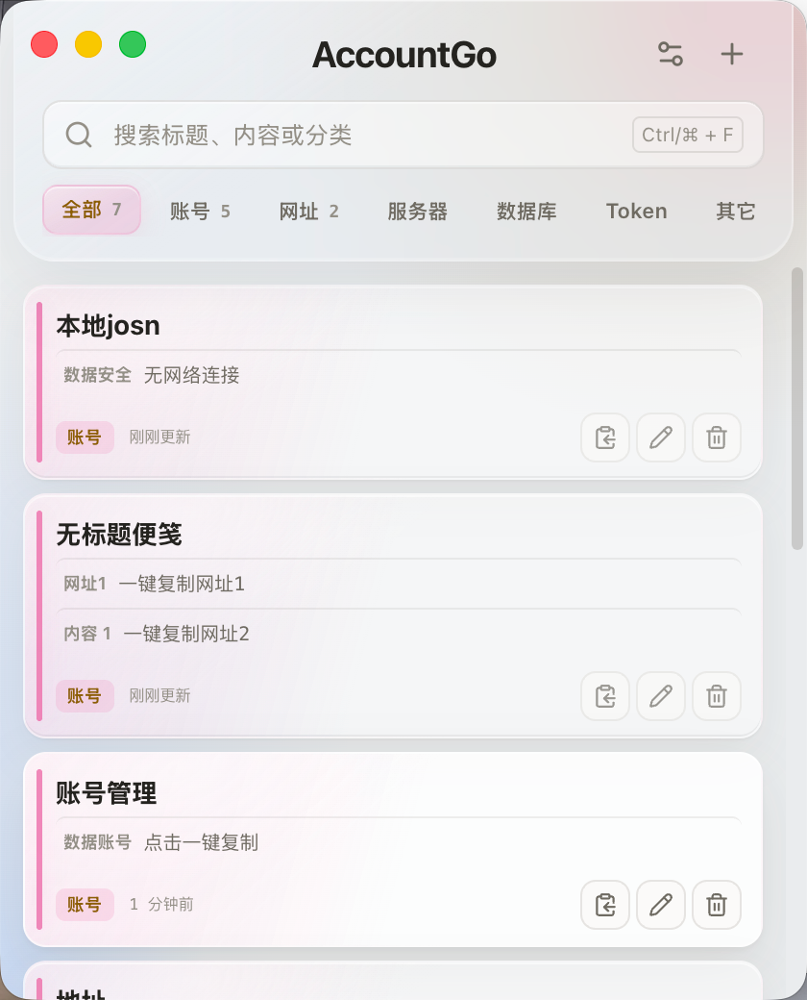

# AccountGo

一款简单、快速的本地信息便笺，用来集中保存账号、服务器地址、数据库连接、网址、Token、SSH 信息和常用文本。

数据只保存在你的电脑上，无需注册账号，也不依赖云端服务。

## 界面预览



## 下载

当前版本：**v1.1.8**

| 系统 | 支持设备 | 下载 |
| --- | --- | --- |
| Windows | Windows 10/11，64 位 | [下载 Windows 安装包](https://github.com/along521/accountGo/releases/latest/download/AccountGo-Setup-1.1.8-x64.exe) |
| macOS | Apple 芯片（M1/M2/M3/M4 等） | [下载 macOS 安装包](https://github.com/along521/accountGo/releases/latest/download/AccountGo-1.1.8-arm64.dmg) |

也可以前往 [Releases](https://github.com/along521/accountGo/releases) 查看全部版本。

## 功能亮点

- **邮箱识别**：自动识别邮箱内容，并提供对应的快捷跳转操作。
- **网站类型识别**：自动判断网站类内容，减少手动选择内容类型的步骤。

## 主要功能

- 使用分类整理账号、服务器、数据库、网址、Token 等信息
- 一条便笺可保存多段内容，并为每段内容设置名称
- 自动识别邮箱和网站类内容
- 点击内容即可复制，也可以一次复制整条便笺
- 支持搜索标题、内容、分类、备注和账号关联网站
- 确认添加或确认修改后保存，避免误操作
- 支持自定义分类、排序、主题色和卡片大小
- 支持浅色、深色或跟随系统外观
- 关闭主窗口后可从系统托盘或菜单栏重新打开
- 数据保存在本机，可直接打开 `data.json` 进行备份或编辑

## 安装说明

### Windows

1. 下载 `AccountGo-Setup-1.1.8-x64.exe`。
2. 双击安装包并按提示完成安装。
3. 从开始菜单或桌面快捷方式打开 AccountGo。

如果 Windows SmartScreen 提示应用来源未知，请确认安装包来自本仓库的 Releases 页面，再选择“更多信息” → “仍要运行”。

### macOS

1. 下载 `AccountGo-1.1.8-arm64.dmg`。
2. 打开 DMG，将 AccountGo 拖入“应用程序”。
3. 在“应用程序”中打开 AccountGo。

当前 macOS 安装包未进行 Apple 开发者签名。首次打开若提示“无法验证开发者”，请在 Finder 中右键 AccountGo，选择“打开”，然后再次确认。

> macOS 安装包仅支持 Apple 芯片，不支持 Intel Mac。

## 快捷键

| 操作 | Windows | macOS |
| --- | --- | --- |
| 搜索 | `Ctrl + F` | `⌘ + F` |
| 新建便笺 | `Ctrl + N` | `⌘ + N` |
| 全局唤醒 | `Ctrl + Shift + A` | `⌘ + Shift + A` |
| 关闭编辑器 | `Esc` | `Esc` |

## 数据与隐私

AccountGo 不需要登录，数据不会自动上传到云端。所有内容都保存在当前电脑的 `data.json` 文件中；你可以在应用右上角打开“外观与数据”，然后选择“打开 data.json”进行查看或备份。

**请注意：当前版本使用明文 JSON 保存数据，不提供加密。** 如果用于保存密码、Token 等敏感信息，请确保电脑账户、磁盘加密和系统登录密码已得到妥善保护，并定期备份 `data.json`。

如果外部修改了 `data.json`，保存后回到 AccountGo，点击“重新读取”即可加载最新内容。

从旧版升级时，v1/v2 数据会自动迁移为 v3；原有内容会作为普通文本保留，无需手动修改 JSON。

## 校验安装包

下载完成后，可使用 SHA-256 校验文件完整性：

```text
72bec3355c06d6850b2c7946801000645e57c46bb403b83755cb656b269d5ec0  AccountGo-1.1.8-arm64.dmg
6adcef523aeab9c424e9308f2c7d70c06e4b34c9846fa6960a3d9b18a0f92792  AccountGo-Setup-1.1.8-x64.exe
```

## 反馈问题

如果遇到无法安装、数据读取异常或功能问题，请前往 [Issues](https://github.com/along521/accountGo/issues) 提交反馈，并附上操作系统版本和问题截图。

---

Copyright © ALONG
